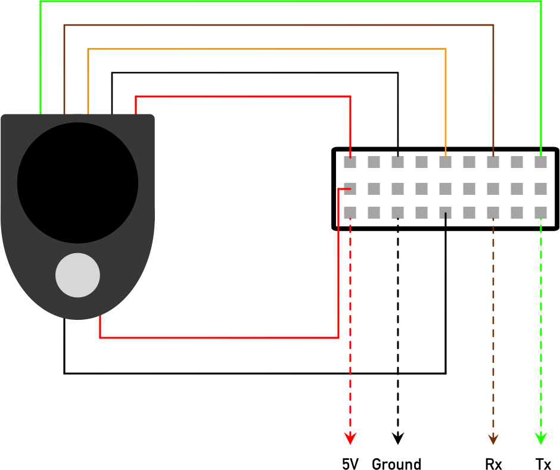
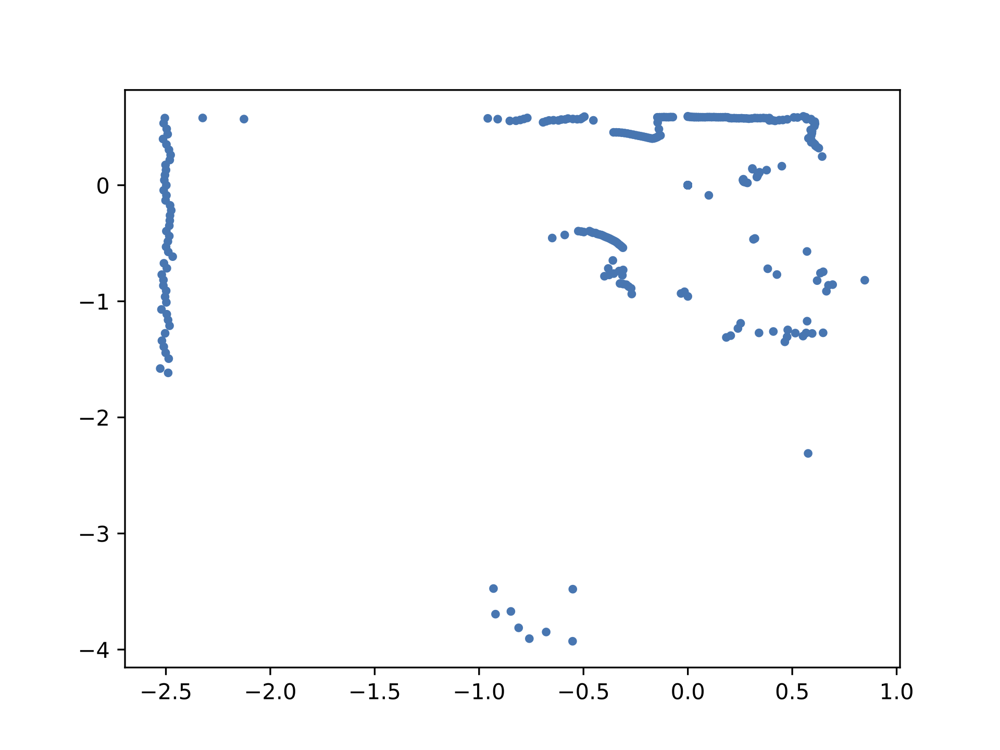

# HLDS (Hitachi-LG data storage) lidar

Asynchronous Python serial interface to HLDS lidar. After instantiating a `LIDAR` object, `start()` the lidar and `await` a call to `getLidar()` to obtain coordinates and intensities of lidar points.

```python
async def runLIDAR():

    lidar = LIDAR()

    lidar.start()

    lidarXY = await lidar.getLIDAR()
    x, y, intensities = lidarXY

    # ...

    lidar.stop()

asyncio.run(runLIDAR())
```

# Wiring schematic

<p align="center">
  
</p>

Where `Rx` and `Tx` are 3.3V serial receive and transmit lines. For example, connect these to the UART `Tx` and `Rx` pins on a Raspberry Pi (pins 8 and 10). Be aware however that most Arduinos use 5V signalling, so in this case you would need to use a level shifter. The baud rate of the HLDS LIDAR is 230400.

# Interface

By default the `LIDAR` interface class is designed for use with a Raspberry Pi, where the default serial interface is on port `/dev/ttyAMA0`.

When activated, the LIDAR interface sends a `b` character to turn the LIDAR device on. When `getLidar()` is called asynchronously, the interface waits until the start of a data frame is captured, reads out the entire frame (this might take a couple of seconds), and then returns it using `asyncio`. If the interface object is deleted (for example, if it gets garbage collected or the program terminates), an `e` character is sent to turn the LIDAR device off cleanly.

# Example output

<p align="center">
  
</p>
